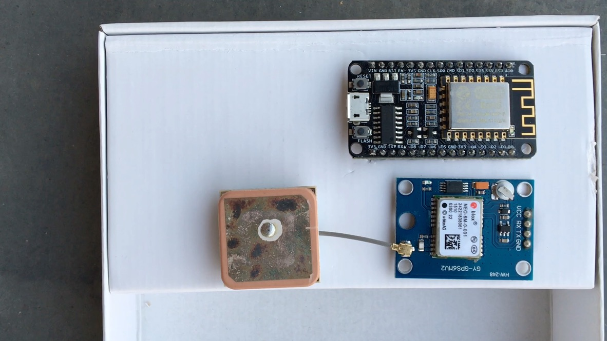
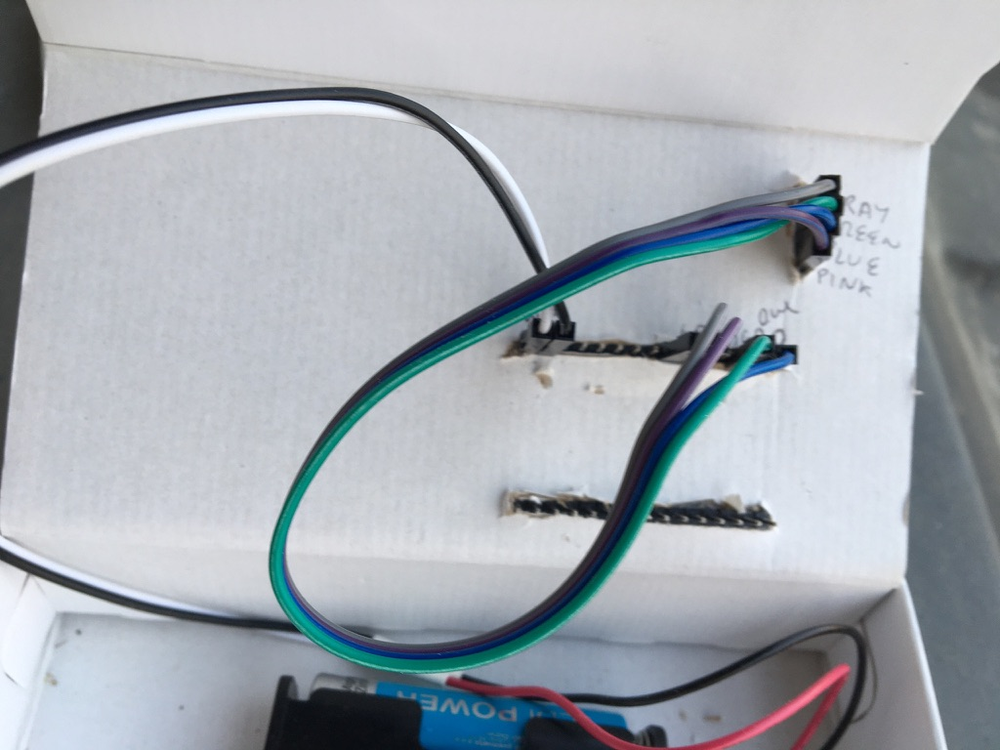
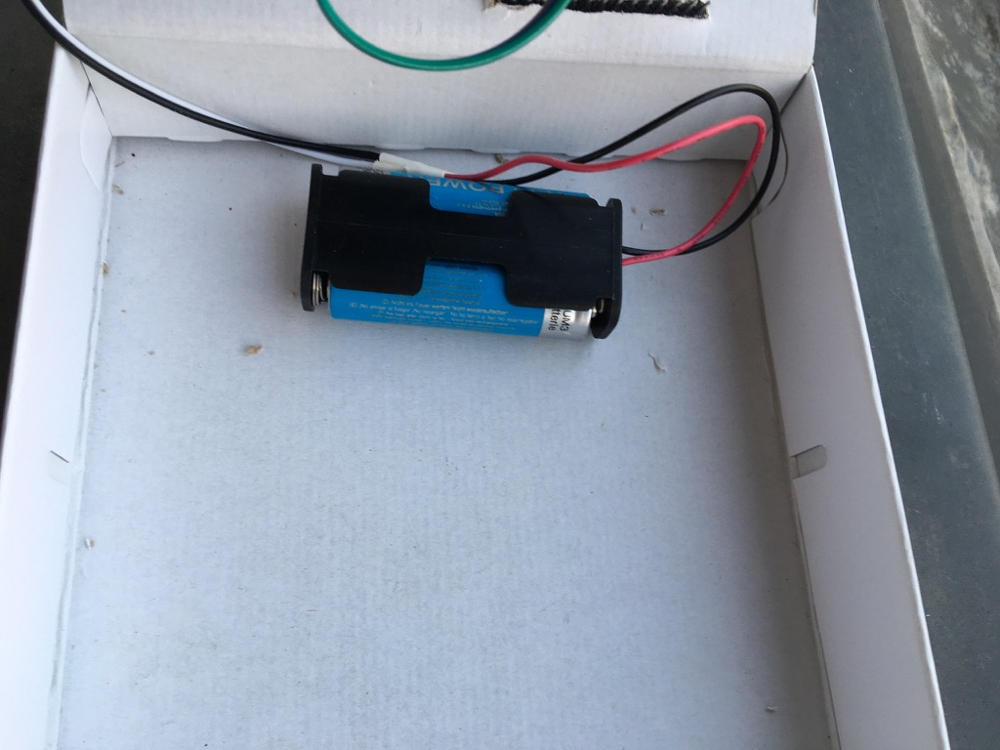
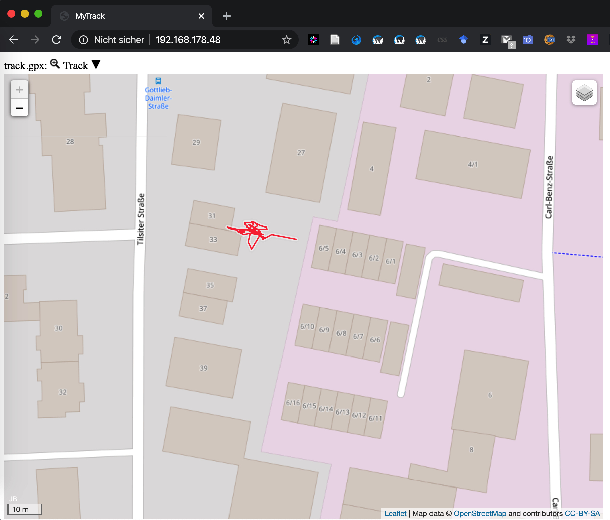

# GPStracker-DIY
This is an GPStracker Do It Yourself. This means, this device not only tracks the position where it is carried around, but also store the tracks and visualise them through embedded UI.

# Motivation
Several GPS trackers exist on the market. While their origin lies in the time when mobile phones and mobile apps (like RunKeeper) did not existed yet, the GPS trackers find a new use for reconstructing movements of un-attended things. For example, learn the path behavior of your own cat; or track the path that your car did (while you lended it to your chldrens), or track the path that the package you sent to your friend did, or many other applications where one is not expected of carrying an expensive mobile phone.
Most of those devices however are rather expensive and include monthly fee since they require the use of SIM card. Furthermore most of them send the data (through the SIM card) to the provider through proprietary protocols and therefore if the provider no longer delivers the service, the (expensive) tracker cannot be used anymore.
This his happened to me once with the Nabaztag ... once their provider left the market, while the source code of the server became available ... the device coould no longer be used end ended in trashcan (recyclable).

# Objectives

- IOT device
- self-contained
- measure GPS every 10 seconds
- upon connection with WIFI provides embedded visualisation of the path it made
- without use of G4E maps (to avoid fees)..

# Solution
- Hardware:
  - CPU : NodeMCU (4MB EEPROM = 20 Bytes / Sec  2 days of data collection)
  - Sensor : Neo6M GPS
  - Power: 2x 1.5 V Batteries
  
- Software
  - Arduino modules:
    - GPS data collection: TinyGPS++ (https://github.com/mikalhart/TinyGPSPlus)
    - Data storage: FS
    - Asynchronous Web server:
      - ESPAsyncWebServer (https://github.com/me-no-dev/ESPAsyncWebServer) /
      - ESPAsyncTCP (https://github.com/me-no-dev/ESPAsyncTCP )
  - Visualisation:GPXViewer  https://www.j-berkemeier.de/GPXViewer/

# Demonstration photos

#### References:
https://randomnerdtutorials.com/esp8266-web-server-spiffs-nodemcu/
